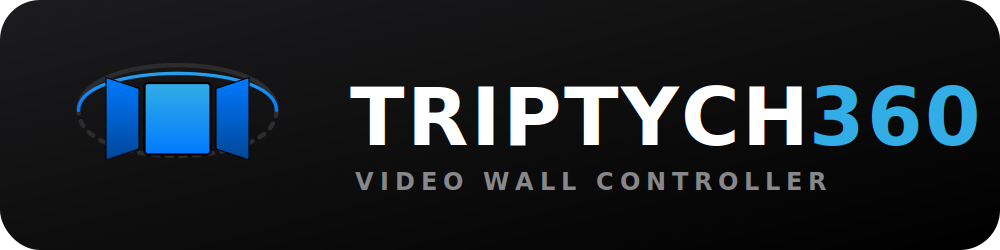

<div align="center">
  
</div>

# Triptych360 - 360 Video Wall Controller

Triptych360 is a Python application built with PySide6 and ModernGL that takes a 360-degree equirectangular image or video and projects it in real-time onto three separate windows representing Left, Front, and Right views. This is designed for video wall installations mapped in a U-shape.

The projection mapping is entirely GPU-accelerated using GLSL fragment shaders, making it highly performant and capable of decoding high-framerate videos smoothly.

## Features
- **GPU-Accelerated**: Fast real-time Equirectangular to Rectilinear conversion.
- **Video Playback**: Native support for auto-looping 360 videos (`.mp4`, `.mkv`, `.avi`, `.mov`) via OpenCV.
- **3D Model Support**: Load LiDAR point clouds from `.las` / `.laz` and Gaussian splats from `.ply` / `.splat`.
- **Multi-Window Display & Kiosk Mode**: Automatically opens up 3 separate views. Check the "Kiosk Mode" box to make them frameless and smoothly lock onto your 3 monitors. The projection math cleanly locks the edges to precisely 90 degrees horizontally, ensuring a seamless U-shape layout.
- **Interactive Unified Controller**: Use your mouse to rotate and zoom across all display outputs instantly.
- **3Dconnexion SpaceMouse Support**: Move around your panoramas smoothly using native SpaceMouse integration.
- **Auto-Panning Idle Animation**: If the system is left untouched for 5 seconds, it will automatically slowly pan around the scene to attract an audience.
- **Config & State Saving**: The app will remember your last loaded video, your exact rotation and zoom levels, and your window preferences on next launch.

## Setup

1. Create a Python virtual environment and activate it:
   ```bash
   python -m venv venv
   source venv/bin/activate  # On Windows, use `venv\Scripts\activate`
   ```

2. **System Dependencies (macOS for SpaceMouse):**
   If you plan to use a 3Dconnexion SpaceMouse, ensure the HID library is installed globally on your machine:
   ```bash
   brew install hidapi
   ```

3. Install python dependencies:
   ```bash
   pip install -r requirements.txt
   ```

## Usage

1. **Launch the application:**
   ```bash
   python triptych360.py
   ```

2. **Load Media:**
   * A controller window will appear. Click "Load Equirectangular Media".
   * You can test with the provided `sample_equirectangular.jpg` or load any supported video/image/3D file (`.las`, `.laz`, `.ply`, `.splat`).
   * Three new windows will open showing the Left, Front, and Right segments of the media.

3. **Navigate & Control:**
   * **Mouse**: Click and drag inside the main controller window to pitch and yaw around the scene. Use the **Scroll Wheel** to perfectly fine-tune the Zoom (Field of View).
   * **SpaceMouse**: Twist or tilt the controller knob to smoothly pan and look around.
   * **Idle**: Just let go! After 5 seconds, the view begins auto-panning automatically.
   
4. **Kiosk Mode & Saving State:**
   * Check the **Kiosk Mode** checkbox on the main screen to drop all window borders and auto-snap the walls to multiple monitors. 
   * When you close the app, your setup (current media, position, zoom, and kiosk preference) is saved securely to `config.json` and loads automatically next launch!

## Generating a Test Image
If you want to generate a new calibrated test grid, you can run:
```bash
python create_sample.py
```